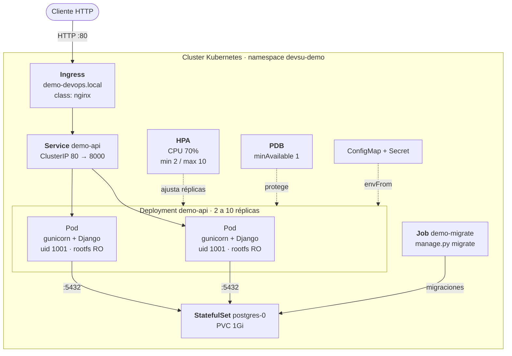
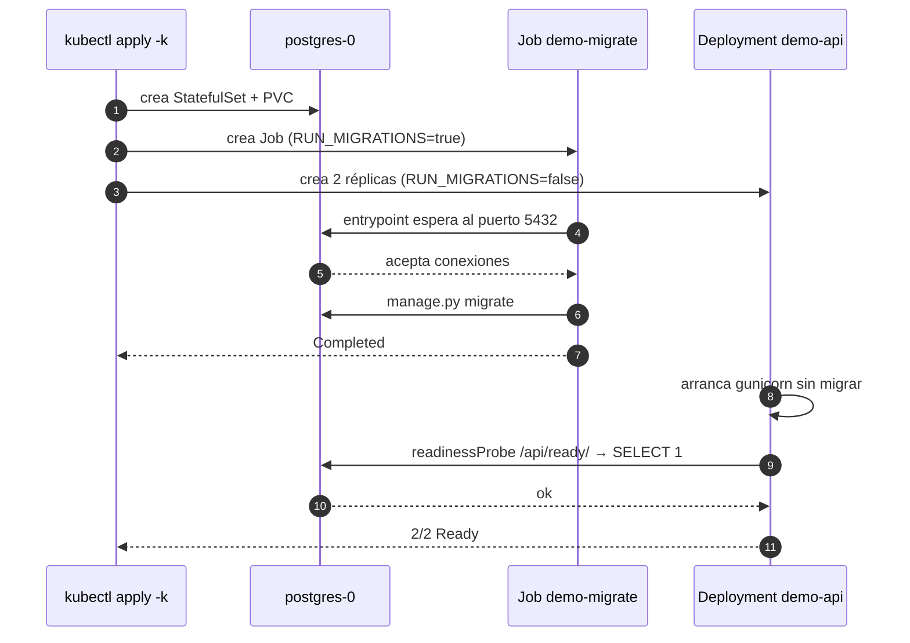
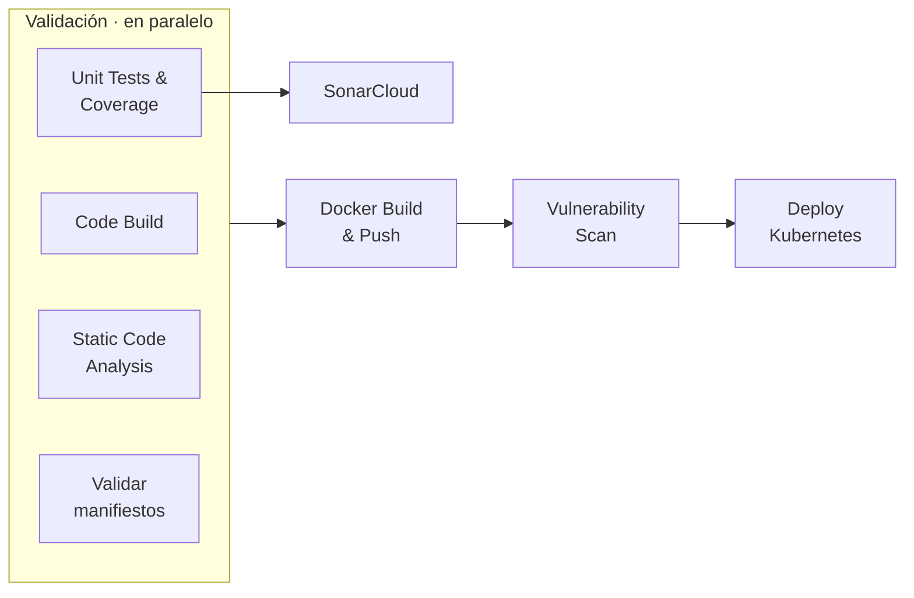

# Demo DevOps Python

[](https://github.com/DominatorJeca/devops-test-practice-python/actions/workflows/ci.yml)
[](https://sonarcloud.io/summary/overall?id=DominatorJeca_devops-test-practice-python)
[](https://sonarcloud.io/summary/overall?id=DominatorJeca_devops-test-practice-python)


| | |
|---|---|
| **Repositorio** | https://github.com/DominatorJeca/devops-test-practice-python |
| **Pipeline** | [Última ejecución completa](https://github.com/DominatorJeca/devops-test-practice-python/actions/runs/37974692476) |
| **Imagen** | `ghcr.io/dominatorjeca/devops-test-practice-python:latest` (pública) 
| **Calidad** | [SonarCloud](https://sonarcloud.io/summary/overall?id=DominatorJeca_devops-test-practice-python)

---

##Tabla de Contenido
- [Stack](#stack)
- [Arquitectura](#arquitectura)
- [Cómo ejecutar](#cómo-ejecutar)
- [Variables de entorno](#variables-de-entorno)
- [API](#api)
- [Pipeline CI/CD](#pipeline-cicd)
- [Recursos de Kubernetes](#recursos-de-kubernetes)
- [Decisiones técnicas](#decisiones-técnicas)
- [Limitaciones conocidas](#limitaciones-conocidas)
- [Evidencias](#evidencias)
---

## Stack

| Capa | Tecnología |
|---|---|
| Aplicación | Python 3.11, Django 5.2 LTS, Django REST Framework |
| Servidor | Gunicorn (3 workers × 2 threads) + WhiteNoise |
| Base de datos | PostgreSQL 16 (`psycopg` 3) |
| Contenedor | Docker multi-stage sobre `python:3.11-slim-trixie` |
| Orquestación | Kubernetes + Kustomize (base + overlays) |
| CI/CD | GitHub Actions, GHCR, SonarCloud, Trivy |

---

## Arquitectura



### Secuencia de arranque

El orden importa: las migraciones corren **una sola vez** en un Job, no en
cada réplica.



---

## Cómo ejecutar

### Opción 1 · Docker Compose (la más rápida)

```bash
docker compose up --build
curl http://localhost:8000/api/health/
```

Levanta la API y PostgreSQL con la red interna ya resuelta. No requiere
configuración previa.

### Opción 2 · Local sin contenedores

Requiere Python 3.11 y un PostgreSQL accesible (o `DB_ENGINE=sqlite`).

```bash
python -m venv .venv
source .venv/bin/activate          # Windows: .\.venv\Scripts\Activate.ps1
pip install -r requirements-dev.txt

cp .env.example .env               # y edita los valores
python manage.py migrate
python manage.py test
python manage.py runserver
```

### Opción 3 · Kubernetes

Requiere un cluster local (Docker Desktop o minikube), `kubectl` y Helm.

```bash
# Prerequisitos del cluster
helm repo add ingress-nginx https://kubernetes.github.io/ingress-nginx
helm install ingress-nginx ingress-nginx/ingress-nginx \
  -n ingress-nginx --create-namespace

helm repo add metrics-server https://kubernetes-sigs.github.io/metrics-server/
helm install metrics-server metrics-server/metrics-server \
  -n kube-system --set "args={--kubelet-insecure-tls}"

# Resolución del host (añadir al archivo hosts del sistema)
echo "127.0.0.1 demo-devops.local" | sudo tee -a /etc/hosts

# Construir y desplegar
docker build -t devsu-demo:dev .
kubectl apply -k k8s/overlays/local

kubectl get all,ingress,hpa,pdb -n devsu-demo
curl http://demo-devops.local/api/health/
```

> En Windows con PowerShell, `curl` es un alias de `Invoke-WebRequest`.
> Usa `curl.exe` para la sintaxis de los ejemplos.

#### Verificar el escalamiento horizontal

```bash
# Terminal 1
kubectl get hpa demo-api -n devsu-demo -w

# Terminal 2 — genera carga
kubectl run -n devsu-demo load --rm -it --image=busybox:1.36 --restart=Never \
  -- /bin/sh -c "while true; do wget -q -O- http://demo-api/api/users/ >/dev/null; done"
```

Las réplicas suben al superar el 70% de CPU y bajan tras la ventana de
estabilización de 5 minutos.

---

## Variables de entorno

Ninguna está embebida en la imagen. Se inyectan por ConfigMap (configuración)
y Secret (credenciales). Ver [`.env.example`](.env.example).

| Variable | Por defecto | Descripción |
|---|---|---|
| `DJANGO_SECRET_KEY` | *(clave de desarrollo)* | Firma de sesiones y CSRF. **Obligatoria en producción** |
| `DJANGO_DEBUG` | `False` | Modo depuración. Lo inseguro requiere acción explícita |
| `DJANGO_ALLOWED_HOSTS` | `localhost,127.0.0.1` | Hosts admitidos, separados por coma |
| `DJANGO_LOG_LEVEL` | `INFO` | Nivel de log a stdout |
| `DB_ENGINE` | `sqlite` | `sqlite` o `postgres` |
| `DB_NAME` | `db.sqlite3` | Nombre de la base de datos |
| `DB_USER` / `DB_PASSWORD` | *(vacío)* | Credenciales de PostgreSQL |
| `DB_HOST` / `DB_PORT` | *(vacío)* / `5432` | Endpoint de PostgreSQL |
| `RUN_MIGRATIONS` | `true` | Si el contenedor aplica migraciones al arrancar |

---

## API

| Método | Ruta | Respuesta |
|---|---|---|
| `GET` | `/api/health/` | `200` — proceso vivo. No consulta la base de datos |
| `GET` | `/api/ready/` | `200` listo · `503` base de datos inaccesible |
| `GET` | `/api/users/` | `200` — lista de usuarios |
| `POST` | `/api/users/` | `201` creado · `400` DNI duplicado o datos inválidos |
| `GET` | `/api/users/<id>/` | `200` · `404` si no existe |

```bash
curl -X POST http://localhost:8000/api/users/ \
  -H "Content-Type: application/json" \
  -d '{"dni":"1234567890","name":"Javier"}'
```

---

## Pipeline CI/CD

Definido en [`.github/workflows/ci.yml`](.github/workflows/ci.yml).



| Job | Qué hace | Falla si |
|---|---|---|
| **Code Build** | Compila el proyecto y valida la configuración de Django | Hay errores de sintaxis o configuración |
| **Unit Tests & Coverage** | 8 tests contra **PostgreSQL real**, no SQLite | Falla un test o la cobertura baja del 80% |
| **Static Code Analysis** | `flake8` (estilo) y `bandit` (seguridad del código) | Hay violaciones de estilo o riesgos de severidad media/alta |
| **Validar manifiestos** | Renderiza el overlay y lo valida con `kubeconform` | Un manifiesto no cumple el esquema de la API |
| **SonarCloud** | Calidad y cobertura consolidadas | No rompe el build; alimenta el Quality Gate |
| **Docker Build & Push** | Construye y publica en GHCR con tag `sha-<commit>` y `latest` | Falla la construcción o la publicación |
| **Vulnerability Scan** | Trivy sobre la imagen publicada | Hay HIGH/CRITICAL **con parche disponible** |
| **Deploy Kubernetes** | Cluster kind efímero, despliega el overlay `ci` y hace smoke test real | No arranca, no migra o la API no responde |

El despliegue no es simbólico: crea el cluster, aplica los manifiestos,
espera al Job de migraciones y al rollout, y verifica con peticiones HTTP
reales a través del Ingress (`health`, `ready`, `POST` y `GET` de usuarios).

---

## Recursos de Kubernetes

Organizados con **Kustomize**: una base común y overlays por entorno.

```
k8s/
├── base/                      # idéntico en todos los entornos
│   ├── namespace.yaml
│   ├── serviceaccount.yaml    # sin token de API montado
│   ├── configmap.yaml
│   ├── deployment.yaml        # 2 réplicas, probes, securityContext
│   ├── service.yaml
│   ├── ingress.yaml
│   ├── hpa.yaml               # escalamiento horizontal
│   ├── pdb.yaml
│   ├── networkpolicy.yaml
│   └── migration-job.yaml
└── overlays/
    ├── local/                 # + PostgreSQL en el cluster, secretos de desarrollo
    └── ci/                    # reutiliza local; solo fija la imagen al SHA
```

| Recurso | Configuración destacada |
|---|---|
| **Deployment** | 2 réplicas · `maxUnavailable: 0` · `runAsNonRoot` uid 1001 · `readOnlyRootFilesystem` · `drop: ALL` · `seccompProfile: RuntimeDefault` |
| **Probes** | `startup` (hasta 60 s) · `liveness` sin base de datos · `readiness` con `SELECT 1` |
| **HPA** | 2–10 réplicas por CPU al 70%, con políticas antiflapping |
| **PDB** | `minAvailable: 1` durante drenajes de nodo |
| **Service** | ClusterIP 80 → 8000 |
| **Ingress** | `ingressClassName: nginx`, host `demo-devops.local` |
| **NetworkPolicy** | Ingress solo desde `ingress-nginx`; egress solo a PostgreSQL y DNS |
| **Job** | Migraciones desacopladas de las réplicas |
| **StatefulSet** | PostgreSQL con PVC de 1Gi y `pg_isready` como probe |

---

## Decisiones técnicas

### PostgreSQL en lugar del SQLite original

Con 2 réplicas, SQLite daría a cada pod **su propia base de datos**: dos
clientes idénticos verían datos distintos. Se parametrizó el motor
(`DB_ENGINE`) para mantener SQLite en desarrollo y usar PostgreSQL en
contenedor, Kubernetes y CI.

### Las migraciones corren en un Job, no en las réplicas

Si cada réplica ejecutase `migrate` al arrancar, dos pods competirían por
aplicar el mismo esquema. El `entrypoint.sh` respeta `RUN_MIGRATIONS`: el
ConfigMap lo pone a `false` para el Deployment y el Job lo sobrescribe a
`true`.

### Las probes envían una cabecera `Host` explícita

El kubelet consulta las probes **por la IP del pod**, que nunca estará en
`ALLOWED_HOSTS`. Sin la cabecera, Django responde `400` y los pods nunca
pasan a `Ready`. La alternativa habitual —`ALLOWED_HOSTS: ["*"]`— desactiva
una protección real contra *Host header injection*.

### `liveness` no consulta la base de datos; `readiness` sí

Si `liveness` dependiese de PostgreSQL, una caída de la base reiniciaría
**todas** las réplicas en cascada, empeorando el incidente. `liveness`
responde si el proceso vive; `readiness` retira el pod del balanceo
mientras la base no esté disponible, sin matarlo.

### El HPA escala solo por CPU

El escalado horizontal funciona cuando repartir la carga **baja la
métrica**. Con CPU ocurre; con la memoria de un proceso Python no: cada pod
carga Django y sus workers independientemente del tráfico, así que añadir
réplicas no reduce la memoria por pod y la condición de escalado nunca se
resolvería. Se detectó en pruebas —el HPA escalaba al máximo en reposo— y
se corrigió calibrando `requests.memory` al consumo real (256Mi) y dejando
la memoria bajo control de `limits`, no del autoescalado.

### `ALLOWED_HOSTS` incluye el DNS interno del Service

Las llamadas entre servicios dentro del cluster usan `http://demo-api/`.
Sin ese nombre en la lista, Django las rechazaría con `400`.

### Imagen multi-stage, sin root y sin herramientas de build

El stage de construcción crea un *virtualenv* que el stage final copia; la
imagen de runtime no contiene compiladores. Se eliminan `pip`, `setuptools`
y `wheel` del resultado: **8 de los 9 hallazgos** del escaneo provenían de
sus dependencias vendorizadas (`urllib3`, `msgpack`, `jaraco.context`),
no del código de la aplicación. El `HEALTHCHECK` usa `urllib` de la
biblioteca estándar en vez de instalar `curl`, evitando ~15 MB y su
superficie de CVE. Resultado: **68 MB comprimidos**.

### Trivy falla solo ante vulnerabilidades corregibles

El primer escaneo arrojó 44 HIGH de paquetes Debian, **todas sin versión
corregida publicada**. Un control que falla por algo que no se puede
arreglar se acaba desactivando. El gate usa `ignore-unfixed: true` y un
segundo paso informativo reporta el total sin romper la ejecución.

### Salto de Django 4.2 a 5.2 LTS

Django 4.2 alcanzó su fin de vida y no recibe parche para CVE-2026-15307.
Aunque la vulnerabilidad afecta a GeoDjango —módulo que esta aplicación no
carga—, entregar un framework sin soporte no es defendible. 5.2 LTS tiene
soporte hasta 2028.

### Base del contenedor fijada a una release concreta

`python:3.11-slim` es un blanco móvil: al publicarse una nueva Debian, la
construcción cambiaría de sistema operativo sin intervención. Se fija a
`slim-trixie` para que el build sea reproducible.

### Los tests no dependen de identificadores fijos

Los tests originales afirmaban `id == 1` y `id == 2`. En SQLite funciona
porque el rollback de cada test reinicia el autoincremento; en PostgreSQL
**las secuencias no se revierten**, así que los identificadores crecen entre
tests y las aserciones fallan. Se reescribieron contra el objeto creado en
`setUp`. Se añadieron además los casos de error (DNI duplicado, datos
inválidos, 404) que no tenían cobertura: de 3 tests a 8, con un 86% de
cobertura y umbral mínimo del 80%.

### Kustomize con base y overlays

El overlay de CI son doce líneas que reutilizan el local y solo redefinen la
imagen. Un futuro overlay de cloud solo necesitaría parchear el ConfigMap
—para apuntar a una base de datos gestionada— y el Ingress. Sin duplicar
deployment, probes, HPA ni securityContext.

---

## Limitaciones conocidas

Enumeradas de forma explícita, tal como pide el enunciado.

| Limitación | Por qué | Qué se haría en producción |
|---|---|---|
| **Sin despliegue en cloud público** | No se abordó el punto extra de IaC con Terraform. El despliegue del pipeline usa un cluster kind efímero dentro del runner | Terraform para AKS/EKS/GKE más un overlay `cloud` |
| **Secrets de Kubernetes en base64** | Un Secret nativo no está cifrado: cualquiera con lectura sobre el namespace lo ve en claro | Cifrado en reposo en etcd y External Secrets Operator contra el gestor de secretos del proveedor |
| **NetworkPolicy declarada pero no aplicada** | El CNI por defecto de Docker Desktop y kind no la hace cumplir. El recurso es correcto y surtiría efecto en un CNI como Calico o Cilium | CNI con soporte de NetworkPolicy |
| **PostgreSQL dentro del cluster** | Una sola réplica, sin backups ni alta disponibilidad | Base de datos gestionada (RDS, Azure Database, Cloud SQL) |
| **Sin TLS** | El Ingress sirve HTTP. No se configuró cert-manager | cert-manager con Let's Encrypt y `tls:` en el Ingress |
| **Actions referenciadas por tag** | Un tag de Git se puede mover; un SHA no | Fijar cada action a su hash completo de commit |
| **Sin observabilidad** | Fuera del alcance del ejercicio | Prometheus, Grafana y trazas distribuidas |
| **Credenciales de desarrollo visibles** | `docker-compose.yaml` y el overlay local incluyen credenciales de juguete para que el proyecto arranque recién clonado | Inyección externa en cualquier entorno distinto de local |

---

## Uso de asistencia por IA

Este ejercicio se desarrolló con apoyo de Claude (Anthropic) como asistente
técnico. Se documenta por transparencia y abogando al hecho descrito en el detalle del examen donde no limita el uso de internet

### En qué se apoyó

- **Diagramas** — generación del código Mermaid de los tres diagramas de
  arquitectura, secuencia y pipeline.
- **Documentación** — estructura y redacción de este README.
- **Diagnóstico de incidencias** — análisis de errores a partir de logs y
  salidas de comandos.

### Incidencias resueltas durante el desarrollo

| Síntoma | Causa raíz y solución |
|---|---|
| `FATAL: la autentificación password falló para el usuario «demo»` pese a que las credenciales eran correctas | Un **PostgreSQL 17 instalado nativamente en Windows** compartía el puerto 5432 con el contenedor, y las conexiones caían en el equivocado. La pista fue que el error llegaba **en español**: la imagen `postgres:16-alpine` responde siempre en inglés. Se confirmó con `netstat` (dos PID distintos escuchando en el 5432) y se resolvió publicando el contenedor en el 5433 |
| Kubernetes no arrancaba en Docker Desktop: `failed to init node with kubeadm`, con ambos provisionadores | El log de la VM revelaba `kubelet is configured to not run on a host using cgroup v1`. Kubernetes 1.36 ya no soporta cgroup v1 y la VM de WSL2 estaba en v1. Se forzó cgroup v2 con `kernelCommandLine = cgroup_no_v1=all` en `.wslconfig` |
| El HPA escalaba al máximo de réplicas con el cluster en reposo | `requests.memory` estaba en 128Mi frente a un consumo real de 148Mi, así que la métrica marcaba 115% de forma permanente. Además, escalar por memoria no puede resolver la condición en un proceso Python. Se calibró el `requests` y se eliminó la métrica de memoria del HPA |
| El generador de carga recibía `400 Bad Request` en todas las peticiones | Al atacar el Service directamente, la cabecera `Host` era `demo-api`, ausente de `ALLOWED_HOSTS`. Se añadió el nombre DNS interno a la configuración, que es además lo correcto para llamadas entre servicios |
| El smoke test del pipeline devolvía `503` pese a que el rollout había terminado | Carrera entre el `Ready` de los pods y la reconciliación de endpoints en el controlador de Ingress. Se separó la espera del enrutado de las aserciones funcionales |
| SonarCloud fallaba con `File api/tests.py can't be indexed twice` | `sonar.sources=api` y `sonar.tests=api/tests.py` se solapaban; Sonar exige conjuntos disjuntos |
| El escaneo de la imagen reportaba 44 vulnerabilidades HIGH | Ninguna tenía versión corregida publicada. Se configuró el gate con `ignore-unfixed` y se redujo la superficie eliminando `pip`/`setuptools` del runtime |

### Alcance

El diseño de la solución, la ejecución de todos los comandos, la verificación
de cada resultado y la validación de los manifiestos fueron realizados por mí persona. La
asistencia se usó para acelerar el diagnóstico y la redacción, no para
sustituir el criterio técnico.

## Evidencias

| Documento | Contenido |
|---|---|
| [docs/docker/](docs/docker/) | Construcción de la imagen, tamaño, usuario no root, escaneo Trivy |
| [docs/kubernetes/](docs/kubernetes/) | Escalamiento horizontal del HPA bajo carga |
| [docs/pipeline/](docs/Pipeline/) | Ejecución completa, smoke test del despliegue y estado del cluster |

---

## Licencia

Proyecto base © 2023 Devsu. Modificaciones realizadas como parte de una
prueba técnica de DevOps.